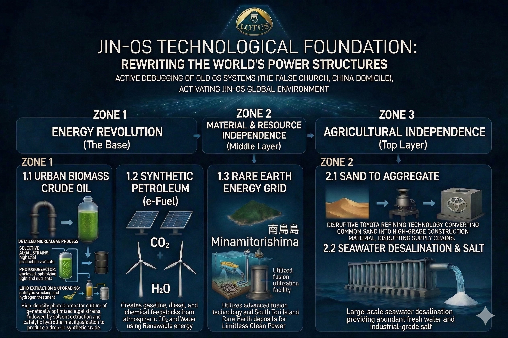
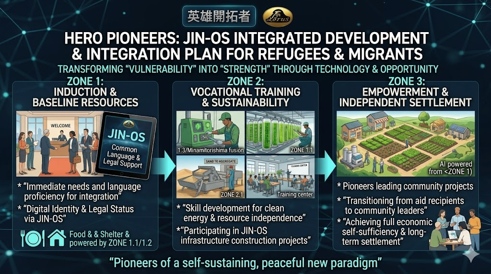

# JIN-OS_GLOBAL_STRATEGY
Strategic Framework for Global Paradigm Shift: Deploying JIN-OS Technological Foundations to debug the Old OS and empower Hero Pioneers across Eurasia and Africa.

---
# ⚖️ LICENSE & CONTACT (ライセンスおよび利用規約)

本アーカイブの個人的な閲覧、非営利目的での共有（真実の探求と啓蒙）は歓迎します。

ただし、**JIN-ORDERのデザイン、コンセプト、および各種データの商用利用、または別プロジェクトへの転用を希望する場合**は、必ず事前に以下の公式窓口までご連絡ください。

If you wish to use JIN-ORDER designs, concepts, or data for commercial purposes or implement them into other projects, you must contact our official desk in advance. Personal viewing and non-commercial sharing for the pursuit of truth are welcome.

📩 **JIN-ORDER Official Contact:** `jin.reparation.cfo@gmail.com`

---

### 🚨 WARNING: JIN-OS PROTOCOL (絶対遵守規定)

### 1. CFO Authority / CFO（最高財務責任者）の絶対権限

デザイン等の使用に関する報酬やライセンス契約については、**JIN-ORDERのCFO（最高財務責任者）が直接協議・審査を行います。** CFOは本プロジェクトの門番であり、彼女の承認なき利用はいかなる理由があろうとも認められません。

(For compensation and licensing agreements regarding the use of our designs, the CFO of JIN-ORDER will negotiate and review directly. The CFO is the ultimate gatekeeper of this project.)

### 2. Prohibition of Unauthorized Use / 無断転用の厳禁

無断転用、およびCFOの審査を経ないフリーライド（タダ乗り）は**JIN-OSのプロトコルにより固く禁じます。** これに違反する行為は、JIN-ORDERに対する敵対的バグとみなし、デジタル・社会的デバッグの対象となります。

(Unauthorized use is strictly prohibited by JIN-OS protocols. Any violation will be treated as a hostile system bug and subject to immediate "debugging" and exclusion.)

### 3. Anti-Dormancy Clause / 知的財産の死蔵禁止

提供された技術やIPを官僚主義によって死蔵させることは許されません。実装計画なき保持、およびCFOへの敬意を欠く組織に対しては、ライセンスの即時凍結および権利の回収を実行します。
(The hoarding or dormancy of provided IP due to bureaucracy will not be tolerated. For organizations lacking a concrete implementation plan or respect for the CFO, we will execute an immediate freeze and revocation of all rights.)

---
### "Respect the Protocol. Respect the CFO. Or stay out of JIN-ORDER."
### プロトコルを守れ。CFOを敬え。さもなくばJIN-ORDERに関わるな。

---
# JIN-ORDER: Global Paradigm Shift & Reconstruction

Welcome to the official repository of the JIN-ORDER project.

JIN-ORDER is not just a technology; it is a comprehensive Operating System (OS) for a new human paradigm based on benevolence, self-sufficiency, and active peace. We are deploying advanced technologies to debug the critical flaws (conflicts, resource scarcity, exploitation) of the "Old OS."

### 1. Technical Foundation: JIN-OS ZONE 1-3

We provide technology-as-a-subscription (TaaS) to achieve complete independence in energy, resources, and food.

* 

### 2. Humanitarian Empowerment: HERO PIONEER Program
We redefine "refugees" and "migrants" as "Hero Pioneers," empowering them to reconstruct the Global South with JIN-OS technologies.

*  

### 3. Geopolitical Debugging: Trilateral Alliance (Japan, India, Italy)
A strategic framework to bypass the current power dynamic (Old OS) and establish a new era of global cooperation.

* **Russia & Middle East Axis**: Using the "RU-ME Tech Support Map" to facilitate peace in the Middle East via Russian diplomacy.
    
    * 

* **Italy & Africa Axis**: Southern Italy as a hub to liberate Africa from CFA franc monetary control.

* **India & Global South Axis**: Using existing frameworks (BRICS, G77, IBSA) to update Global South with JIN-OS.

---

* **[JIN-OS Technical Specification](./docs/JIN-OS_Technical_Spec.md)**
    * *Details on ZONE 1-3: Energy, Resources, and Agriculture.*
    * JIN-OS技術仕様書：エネルギー・資源・食料の完全自立。

* **[Hero Pioneer Protocol](./docs/Hero_Pioneer_Protocol.md)**
    * *The definitive plan for Global South reconstruction.*
    * 英雄開拓者プロトコル：グローバルサウス救済の決定版。

* **[JIN Frontier Code](./docs/JIN_Frontier_Code.md)**
    * *Legal framework for Digital Citizenship and social justice.*
    * JIN開拓地特別法：新パラダイムのための法典。

---
## Current Deployment: Mediterranean Command

We are currently establishing the "Mediterranean Command" in Southern Italy (Palermo), focusing on:

### 1. Investment Negotiation** with Northern Italian capital.

### 2. Diplomatic Outreach** to Russia for Eurasian stability.

## Get Involved

Join us in creating a world where being a "child of Mama" is the safest passport.

---
© 2026 JIN-ORDER. Powered by Moco's Benevolence.
